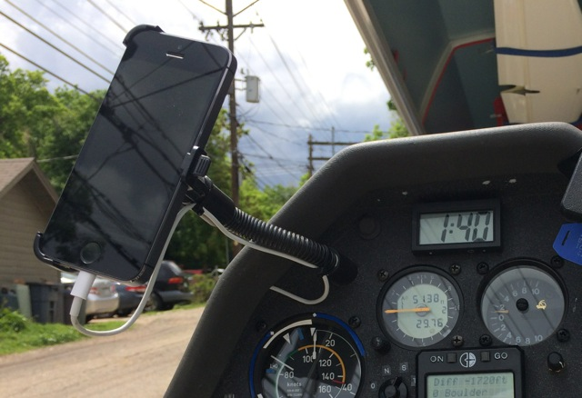
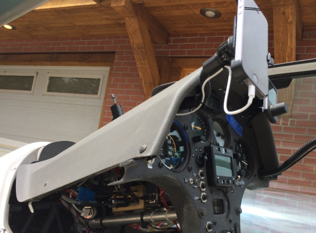
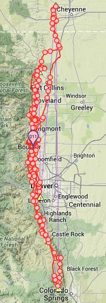
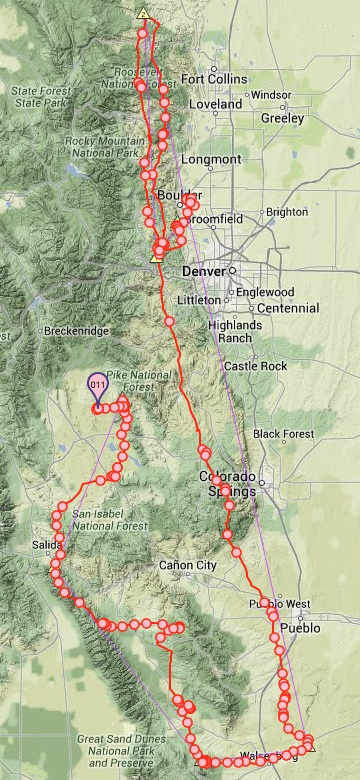

# GlideTrack Mobile Tracker

GlideTrack is a simple mobile tracker for glider flying.  It works in
conjunction with the [GlidePort.aero](http://glideport.aero) track visualization
and analysis web app. It sends high-resolution flight track data to
GlidePort.aero so that spectators can view your flights in real-time (or later).
GlideTrack also allows you to send text messages that can be seen in
GlidePort.aero.

This is a *minimal* functionality reference implementation, it illustrates how
to use the GlidePort.aero API.  GlideTrack source code is available at
[github.com/glideport/GlideTrack](https://github.com/glideport/GlideTrack).
However, GlideTrack is fully functional, you can use it to track your flights in
real-time!

<!--
See [README.md](https://github.com/glideport/GlideTrack/blob/master/README.md)
for more info.
-->

## Setup

Create a GlidePort.aero user account if you do not already have it.  To create a
user account go to [GlidPort.aero](http://glideport.aero) and register.  When
you submit your registration information you will receive an activation email.
Click the link in the email to complete the registration process.  If you don't
receive the registration email, check your spam folder.

Once you have your GlidePort.aero account, run GlideTrack on your mobile phone,
enter your GlidePort login name (your email), and click save.  If needed, update
the glider information that will be associated with this tracker.

## Tracking

Prior to your flight, if you need to update your glider information, tap
"Settings".  Alternatively, you can edit your track in GlidePort.aero after the
flight.

When you tap "START" to start tracking, GlideTrack uses the phone GPS to record
your track and to periodically send it to GlidePort.aero, nominally every 2
minutes.  If there is no cellular phone connectivity, it will keep retrying
until it is able to successfully send data.  If you stop tracking and start
again within 15 minutes, the old track will be continued.

To send a message, enter your message and tap "Send".  To resend a recent
message, tap the message so that it appears in the message box, and tap "Send".
Note that messages can only be sent when tracking is ON.

Tap "STOP" when back on the ground.

### Tips and Tricks

  * It is recommended to run the app and start tracking a few minutes before you
    fly.  That way the GPS will have time to get a good position lock.
  * It is important that your phone has a good view of the sky in order to get a
    good quality track.  For example, if you keep the phone in your pocket, you
    will not get a good quality track.
  * GlideTrack is not optimized for battery life.  It is recommended that you
    plug it into an external battery if you plan to do long flights.  E.g., you
    can buy cheap 12V-to-USB adapters and phone cradles on eBay.

Here is what my setup looks like -- the phone is plugged into the main battery
and has a good view of the sky.

  
iPhone mount and power cord.

  
Side view.  The USB power adapter is visible in the bottom left.

### Mobile Coverage

GlideTrack is tolerant to poor cell-phone coverage.  When there is no coverage,
GlideTrack keeps recording tracking data.  When it is finally able to send data,
it sends everything that has been collected up to that point.

Note that mobile tracking will not be as reliable as satellite tracking (e.g.,
SPOT or inReach).  However, mountain flight tests in Colorado Rockies indicate
that mobile tracking works suprisingly well.  Here are two typical mountain
flights at high altitudes.  The pink/red circles indicate locations where
GlideTrack was able to successfully send tracking data.

 | 

### GPS Quality

The quality of current phone GPSes for flying applications is not as good as
flight recorder.  For example, it is not uncommon see erratic GPS altitudes and
GPS "teleporting".  One thing thing that makes phone GPS perform poorly is the
internal phone GPS filter which is designed and tuned for walking and driving;
e.g., you don’t see erratic altitude when you drive around.   Note that it does
get better as you run your phone for a while, provided the phone has a good view
of the sky.

The location of the phone is very important --- it must have good and
*consistent* view of the sky in order to produce good quality fixes.  The GPS
quality degrades if it has to switch lock to a different set of satellites,
e.g., you get one view of the sky when you are straight and level, and a
different view of the sky if you are banked.

Note that GlideTrack has no GPS filtering whatsoever since its primary intent is
to be an example app how to use the GlidePort API, and thus simple.  Third-party
flying/tracking apps using GlidePort API should have filtering to improve track
quality.  In any case, iPhone 6 will reportedly have a pressure sensor, so at
least that will fix the erratic altitude problem completely.

### Diagnostic Mode

The diagnostic mode can be turned on in the Settings screen.  In the diagnostic
mode successful data transfer events are recorded in the flight track.  This is
useful for analyzing mobile coverage in your flight area.  Also, in this mode
all GPS fixes (typically at 1s interval) are sent, as opposed to fixes
interpolated at 4s interval.

## Development

The GlidePort.aero API is open!  Any gliding software can use the API to send
high-resolution track data to GlidePort.aero so that spectators can follow
flights in real-time.

The GlidePort hi-res track API is described in [API.md](API.md). The heart of
the api is the `gt` call.  It is designed to be as minimal and as simple as
possible.  You essentially pass IGC data (fragment) in the body of an http POST
request.  See Track.js for how it is used.

GlideTrack is implemented in HTML5/JavaScript for simplicity.  It does not use
any third-party libraries.  It can be built into a native app using
Cordova/PhoneGap.  The API can of course be used from any language.

__NOTE__: GlideTrack currently only keeps tracks in memory, it does not save
them.  In other words, if you kill the app or if the app crashes all tracking
that has yet not been sent will be lost.

### Defines

There are a lot of defines in Manager.js, Settings.js, and Track.js.  The
important development mode defines are:

  * `DBGINFO` in Track.js: Switch to true to include transfer info in the track.
    This is useful for analyzing mobile coverage in your flight area.
  * `LOG_ALL` in Manager.js: Switch to true to send raw GPS fixes to the ground.
    The default is to send fixes at 4s interval.
  * `API_URL` in Settings.js: Change to `http://test.glideport.aero/api` for
    development.
  * In Manager.js init() method, uncomment line `this.geoloc=(new gt.Sim)....`
    to feed in simulated flight track locations instead of using the phone GPS.

__Important__: These four values should be switched to default for deployment.

## Terms of Use

See [TERMS.md](TERMS.md).

---
Copyright (c) 2014 TipTop Software, Inc., All Rights Reserved.

